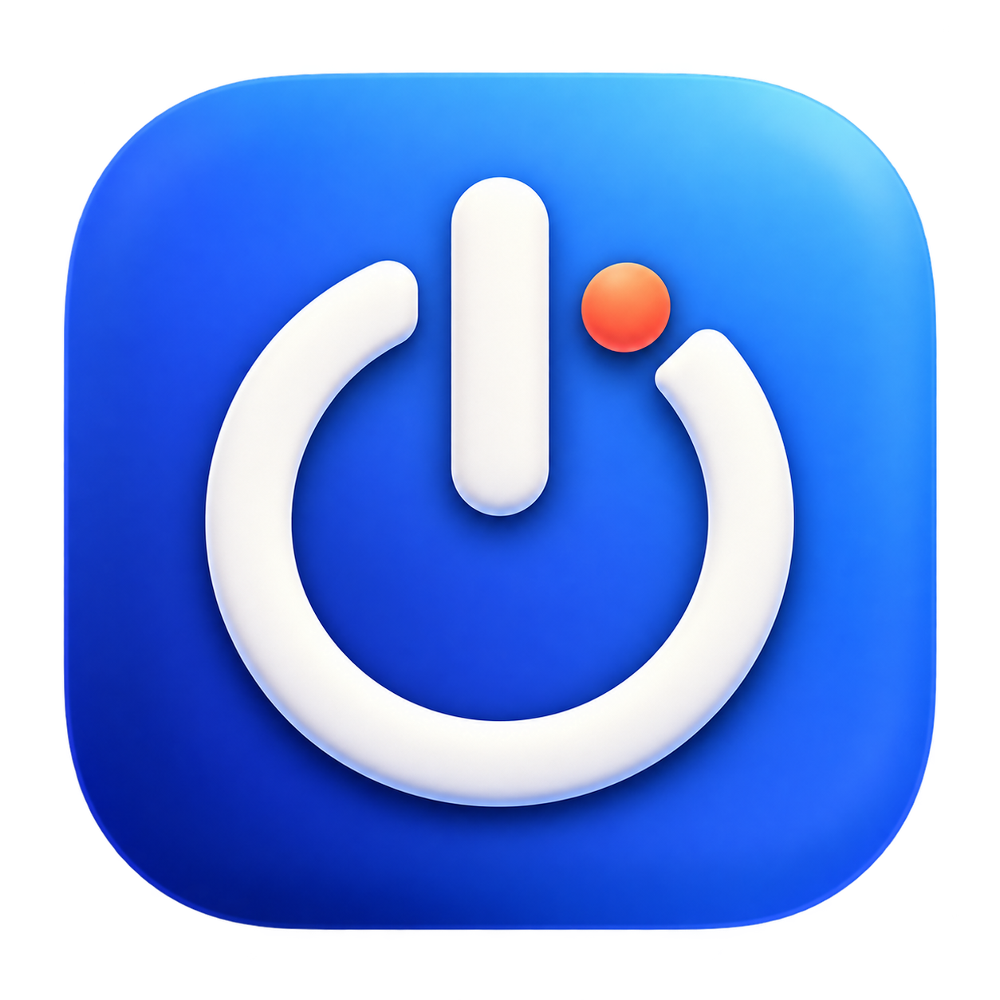

<p align="center">
  
</p>

<h1 align="center">定时关（StopApp）</h1>

<p align="center">一个轻量、原生的 macOS 定时工具，在指定时间关闭所选应用或关闭电脑。</p>

<p align="center">
  <a href="https://github.com/lichspace/stop-app/actions/workflows/build.yml"></a>
</p>

## 下载与安装

- [下载最新版本（StopApp-macOS-unsigned.zip）](https://github.com/lichspace/stop-app/releases/latest/download/StopApp-macOS-unsigned.zip)
- [查看全部版本和更新说明](https://github.com/lichspace/stop-app/releases)

> 下载链接会在仓库首次推送 `v*` 标签并生成 GitHub Release 后生效。

下载后解压，将 `StopApp.app` 拖入“应用程序”文件夹即可。

当前自动构建产物尚未经过 Apple Developer ID 签名和公证。首次打开时若 macOS 阻止运行，请在 Finder 中右键应用并选择“打开”，然后确认运行；也可前往“系统设置 → 隐私与安全性”处理安全提示。

### 系统要求

| 项目 | 要求 |
| --- | --- |
| 操作系统 | macOS 12 Monterey 或更高版本 |
| 处理器 | Apple Silicon 或 Intel Mac |
| 架构 | 通用二进制：`arm64` + `x86_64` |

## 功能

- 自动发现当前运行的桌面应用，并在应用启动或退出后刷新列表。
- 支持搜索和多选要关闭的应用。
- 提供 `5 / 10 / 15 / 20 / 25 / 30 / 40 / 50 / 60` 分钟快捷选项。
- 支持手动输入分钟数，并自动换算成“1小时25分钟”等可读时长。
- 实时显示剩余时间，可随时取消任务。
- 关闭应用时优先请求正常退出，3 秒后仍未退出才强制结束。
- 支持定时向 macOS 发送关机请求。
- 原生 macOS 双栏界面、应用列表 hover 与选中状态反馈。

## 使用方法

### 定时关闭应用

1. 选择“关闭应用”。
2. 在右侧列表中选择一个或多个应用；可通过名称或 Bundle ID 搜索。
3. 从时间菜单中选择快捷时长，或选择“手动输入…”并填写分钟数。
4. 点击“开始计时”。

任务到期时，StopApp 会查找与所选 Bundle ID 相同的运行实例，因此应用在计时期间重新启动后仍可被识别。

### 定时关机

1. 选择“关闭电脑”。
2. 设置倒计时时长。
3. 保存其他应用中的工作，然后点击“安排关机”。

首次执行关机任务时，macOS 可能询问是否允许 StopApp 控制“系统事件”。

## 权限与安全

- 读取当前运行应用和请求应用退出不需要额外权限。
- 关机功能通过 macOS `System Events` 发起，相关权限可在“系统设置 → 隐私与安全性 → 自动化”中管理。
- StopApp 不上传应用列表，不包含网络请求，也不收集使用数据。
- 定时器运行在应用进程内；任务完成前请保持 StopApp 运行。电脑从睡眠状态恢复时，已过期任务会立即执行。

## 本地开发

### 环境要求

- macOS 12 Monterey 或更高版本
- Swift 6 工具链
- Xcode Command Line Tools；使用命令行构建时不要求安装完整 Xcode
- Python 3（仅重新生成 `.icns` 图标时使用）

克隆并运行：

```bash
git clone https://github.com/lichspace/stop-app.git
cd stop-app
swift run StopApp
```

运行测试：

```bash
swift test
```

构建可双击启动的通用应用：

```bash
./scripts/build-app.sh release
open dist/StopApp.app
```

构建产物位于 `dist/StopApp.app`。默认同时构建 Apple Silicon 与 Intel 架构；只构建当前机器架构时可设置 `UNIVERSAL=0`：

```bash
UNIVERSAL=0 ./scripts/build-app.sh release
```

自定义版本号与构建号：

```bash
APP_VERSION=0.2.0 BUILD_NUMBER=12 ./scripts/build-app.sh release
```

重新生成应用图标：

```bash
./scripts/make-icns.py Assets/AppIcon-source.png Assets/AppIcon.icns
```

### 项目结构

```text
.
├── Assets/                         # 图标主图和 ICNS
├── Packaging/Info.plist            # macOS 应用包元数据
├── Sources/StopApp/
│   ├── Models/                     # 定时计划与时长模型
│   ├── Services/                   # 应用发现与操作执行
│   ├── ViewModels/                 # 定时器和界面状态
│   ├── Views/                      # SwiftUI 界面
│   └── StopAppApp.swift            # 应用入口
├── Tests/StopAppTests/             # Swift Testing 单元测试
├── scripts/build-app.sh            # 通用架构应用打包
└── scripts/make-icns.py            # App Icon 生成工具
```

## 持续集成与发布

[GitHub Actions 工作流](https://github.com/lichspace/stop-app/actions/workflows/build.yml)会在以下场景运行测试并构建应用：

- 推送到 `main`
- 提交 Pull Request
- 在 Actions 页面手动触发
- 推送 `v*` 版本标签

普通构建可在对应的 Actions Run 页面下载 `StopApp-macOS-app` Artifact；解压一次即可得到 `StopApp.app`。推送版本标签时，工作流会把标签版本写入应用、生成 ZIP 并自动创建 GitHub Release：

```bash
git tag v0.1.0
git push origin v0.1.0
```

## 参与开发

提交 Pull Request 前请确保：

```bash
swift test
./scripts/build-app.sh release
```

功能修改应同时补充或更新测试；界面修改建议在浅色和深色模式下检查，并确认窗口最小尺寸下没有内容溢出。

## 常见问题

### 应用没有出现在列表中

列表只显示带普通桌面窗口的应用。点击右上角刷新按钮；应用启动和退出时列表也会自动更新。

### 关机任务执行失败

检查“系统设置 → 隐私与安全性 → 自动化”中 StopApp 对“系统事件”的权限，然后重新创建任务。

### 关闭窗口后任务是否继续？

只要 StopApp 进程仍在运行，任务会继续计时。使用 `Command-Q` 完全退出应用会终止尚未执行的任务。
